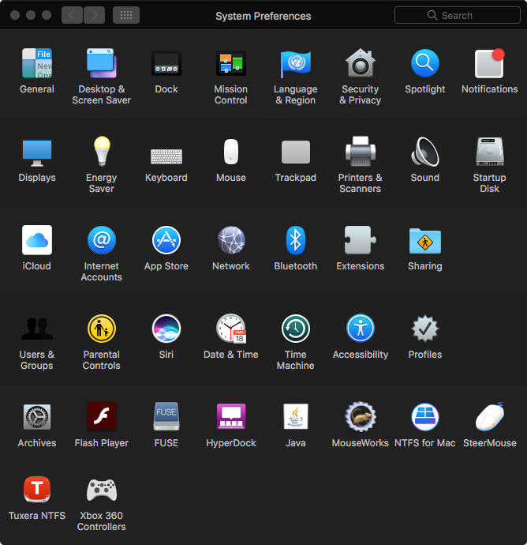

# Dark Mode

 

# Information:

- Designed for 10.10+ (unneccesary on 10.13+, but can be used for the translucent effect)
- Dark Mode is a SIMBL plugin that tries to bring dark mode to versions of macOS that don't come with dark mode
- Author: [w0lfschild](https://github.com/w0lfschild)
- Modifier: [The-SamminAter](https://github.com/The-SamminAter)

# Note:

- Dark Mode isn't perfect, and there are some problems with it
- Not all applications will be effected
- Some applications may look bad or crash
- You can disable Dark Mode for an app using [the GUI](https://github.com/The-SamminAter/DarkMode/blob/master/build/Dark%20Mode's%20GUI.zip) or terminal:
    - `defaults write org.w0lf.darkmode $(osascript -e 'id of app "Application Name"') 0`

# Installation:

1. Download [mySIMBL](https://github.com/w0lfschild/app_updates/raw/master/mySIMBL/mySIMBL_master.zip)
2. Download [Dark Mode](https://github.com/The-SamminAter/DarkMode/blob/master/build/Dark%20Mode.bundle.zip)
3. Unzip both
4. Open and set up `mySIMBL.app` (if you haven't done so before)
6. Open `Dark Mode.bundle` (it should open in `mySIMBL.app`)
7. Restart any application to have Dark Mode applied to it
	
### License:
Pretty much the BSD license, just don't repackage it and call it your own please!    
Also if you do make some changes, feel free to make a pull request and help make things more awesome!
